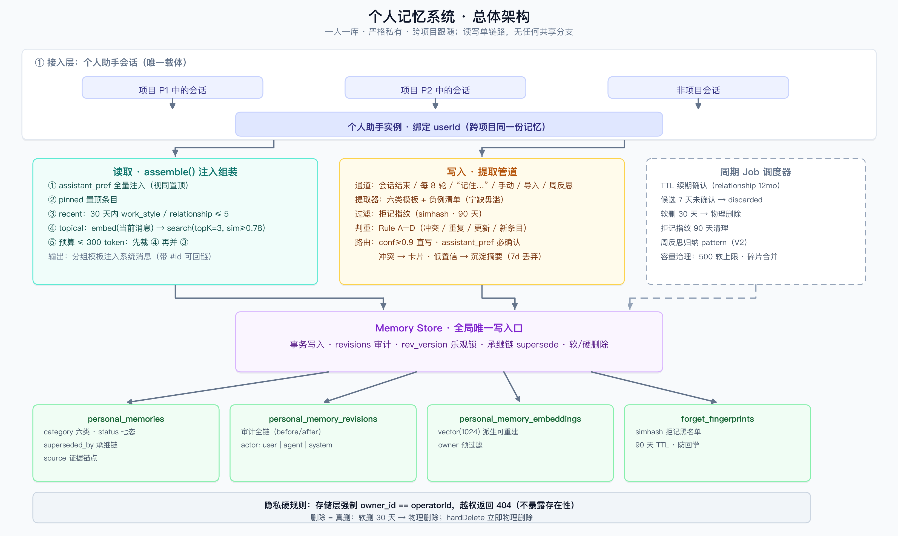
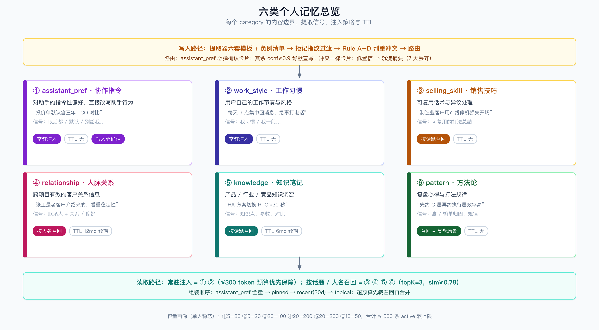

# 个人记忆系统设计

> 版本：V2.0（独立版） · 适用平台：参考腾讯 WorkBuddy「项目空间 + 成员」形态的销售 Agent 平台
> 范围：**仅个人记忆**。本系统自洽完整，不依赖、不涉及任何项目记忆 / 共享记忆 / 组织知识库。
> 一句话定位：**为每个销售提供一份跨项目跟随、严格私有、可溯源、可管理的长期记忆，驱动其个人助手的行为个性化。**
> 配套图：`personal-architecture.png`（总体架构）、`personal-taxonomy.png`（六类记忆总览）



---

## 目录

1. [定位与基本原则](#1-定位与基本原则)
2. [记忆类型体系](#2-记忆类型体系)
3. [如何提取记忆](#3-如何提取记忆)
4. [存储设计](#4-存储设计)
5. [增删改查实现](#5-增删改查实现)
6. [读取与注入](#6-读取与注入)
7. [生命周期与治理](#7-生命周期与治理)
8. [指标](#8-指标)
9. [异常与边界](#9-异常与边界)
10. [待确认事项](#10-待确认事项)
11. [附录 A：提取 Prompt 骨架](#11-附录-a提取-prompt-骨架)
12. [附录 B：端到端走查](#12-附录-b端到端走查)
13. [附录 C：详细示例（对话级走查）](#13-附录-c详细示例对话级走查)

---

## 1. 定位与基本原则

| 属性 | 约定 |
|---|---|
| 归属 | `owner_id = userId`，一人一库，跨项目跟随人（用户在任何项目空间里用的是同一份记忆） |
| 可见性 | **严格私有**：仅本人（及其个人助手）可读；平台管理员默认也不可见 |
| 载体 | 个人助手会话（用户与自己的 AI 助手之间的对话） |
| 内容边界 | 只记「**这个人**」：习惯、偏好、技巧、人脉、知识、方法论。**不记**客户业务事实、项目进展——那不属于本系统 |

四条基本原则：

1. **可溯源**：每条记忆必须带证据锚点（哪次会话、哪条消息），用户永远能问「你从哪学来的」；
2. **可管理**：所有记忆可看、可改、可删、可过期，删除要真删（见 §5.4 硬删）；
3. **不打扰**：提取默认静默，只有两类情况打断用户——改变助手行为的偏好、与既有记忆冲突；
4. **宁缺毋滥**：记错的代价比漏记大（错记忆会持续污染助手行为），一切阈值向保守侧偏。

---

## 2. 记忆类型体系

单级分类 `category`，共六类。提取模板、注入策略、TTL 默认值均按 category 区分。

| category | 记什么 | 销售场景示例 | 注入策略 | 默认 TTL |
|---|---|---|---|---|
| `assistant_pref` | 对助手的**指令性偏好**（改变助手行为） | "邮件一律三段式、结论先行"；“报价单默认含三年 TCO 对比” | **常驻注入**（视同置顶） | 无 |
| `work_style` | 用户自己的工作习惯与节奏 | "我每天 9 点集中回消息"；“周报周五上午发” | 常驻注入（低预算） | 无 |
| `selling_skill` | 可复用的销售话术与技巧 | "制造业客户用产线停机损失开场"；“异议先复述再回应” | 按当前话题召回 | 无 |
| `relationship` | 个人人脉 / 客户关系（跨项目有效） | "张工是老客户介绍来的，看重稳定性"；“李总 6 月孩子高考，别催单” | 按人名/客户名召回 | 12 个月续期 |
| `knowledge` | 个人整理的产品 / 行业 / 竞品知识 | "我们的 HA 方案切换 RTO≈30s"；“竞品 X 按席位收费” | 按当前话题召回 | 6 个月续期 |
| `pattern` | 方法论与复盘心得 | "先约 C 层再约执行层效率高"；“季度末价格审批弹性大” | 按话题召回 + 复盘场景 | 无 |

设计要点：

- **`assistant_pref` 与 `work_style` 必须分开**：前者是「要求助手怎么做」，直接改写助手行为，写入需用户确认；后者是「用户自己怎么工作」，供助手参考语气和节奏，可直写。合并会导致助手把对人的描述误当成指令。
- **`relationship` 是销售的个人资产核心**：跨项目跟随人（老客户会出现在新项目）；只以「来源项目标签」做回溯展示，不做任何项目维度隔离。
- 个人承诺提醒（"提醒我周五回访"）**不属于本系统**——交给任务/待办系统；本系统只记稳定特征。

**容量画像**（单人稳态）：assistant_pref 5–30 / work_style 5–20 / selling_skill 20–100 / relationship 20–200 / knowledge 20–200 / pattern 10–50，**合计 ≤ 500 条 active 软上限**（治理见 §7.2）。



---

## 3. 如何提取记忆

### 3.1 提取通道

| 通道 | 时机 | 说明 |
|---|---|---|
| 会话结束提取 | session close，异步 | 主力通道 |
| 轮次节流 | 每累计 8 轮 | 长会话兜底，避免信息滞留 |
| 显式触发 | 用户说"记住……" 立即 | 同步返回确认卡片 |
| 手动录入 | 记忆管理页 | 全字段可编辑 |
| Onboarding 导入 | 首次启用 | 表单冷启动（§3.6） |
| 周期反思（V2） | 每周 | 跨会话归纳 `pattern`（"你最近三次都用同一种开场"） |

### 3.2 提取判定：什么该记、什么不该记

提取器对每个候选做两道判定：**是不是个人记忆** → **属于哪一类**。

**该记的信号**（命中任一即产出候选）：

| 信号 | 类别 | 例 |
|---|---|---|
| 持续语义句式："以后都…"、"别给我…"、"默认…"、"我习惯…" | assistant_pref / work_style | "以后报价都带上三年 TCO" |
| 可复用技巧/方法论的总结句 | selling_skill / pattern | "先约决策人再约执行层" |
| 关于联系人的、脱离单个项目仍成立的关系信息 | relationship | "张工是我老客户介绍来的" |
| 用户主动沉淀的知识笔记 | knowledge | "记一下：HA 方案 RTO 约 30 秒" |
| 复盘结论（赢/输单归因） | pattern | "这单赢在提前搞定了财务" |

**不该记的负例**（直接丢弃，比"存错"更重要的防线）：

- 一次性情绪、气话、闲聊（"这客户真烦" ❌）；
- 对当前回答的临时纠正（"不对，我是说……" ❌；同类纠正出现 ≥2 次才升级为偏好）；
- 单次任务指令（"帮我把这段话改短" ❌）；
- 对第三方的私下负面评价 ❌（隐私与合规风险，任何情况下都不记）；
- 客户业务事实（预算、决策人、商机进展）❌ ——不属于本系统，交给业务系统；
- 用户在第三方应用/CRM 已结构化维护的字段（若对接）。

### 3.3 提取器契约

输入：

```
{
  "conversation": [ { messageId, role, text, ts } ],   // 本会话新增片段
  "existingMemories": [ { id, category, text } ],       // 近似既有记忆（判重用，≤20 条）
  "userMeta": { userId, role, industries }              // 用户画像（帮助判断）
}
```

输出（JSON）：

```
{
  "candidates": [
    {
      "category": "assistant_pref",
      "text": "报价单默认含三年 TCO 对比",
      "tags": ["报价"],
      "evidenceMessageId": "msg_…",        // 必填，证据锚点
      "confidence": 0.93,
      "expiresAt": null
    }
  ]
}
```

硬性要求：每条 `text` 必须是**一句自包含的话**（脱离对话上下文也能读懂）；`evidenceMessageId` 必填，缺一则丢弃该候选。Prompt 骨架见附录 A。

### 3.4 判重与冲突（Rule A–D）

对每条候选，与本人 active 记忆比对（embedding 相似度 + 结构化字段）：

```
Rule A  结构化冲突：同一主题的指令性内容互斥（如 "报价带 TCO" vs "报价不带 TCO"）
        → 冲突 → 确认卡片（保留旧值 / 覆盖 / 并存）
Rule B  sim > 0.90 且 category 相同
        → 重复：不产生新条目，仅把 evidenceMessageId 追加进旧条目历史
Rule C  0.85 < sim ≤ 0.90
        → LLM 判定「同义 / 更新 / 冲突 / 无关」：
          同义→按 B；更新→supersede 流程（§3.5）；冲突→按 A；无关→新条目
Rule D  sim ≤ 0.85 → 新条目
```

**自我修正是高频场景**（"以后报告写短点" → 三周后 "报告还是要带数据附录"）：Rule C 判为「更新」时默认**直写 supersede**（旧条目 `superseded`、历史留痕），不弹卡片——受众只有本人，打扰成本高于出错成本。唯一例外：被更新的是 `assistant_pref` 时必须弹卡片（助手行为变更必须明示）。

### 3.5 路由决策

| 条件 | 去向 |
|---|---|
| category ≠ assistant_pref，confidence ≥ 0.9，无冲突 | **直接 active**（静默，进入沉淀摘要回顾） |
| category = assistant_pref | 确认卡片（明示后才能生效） |
| 有冲突（Rule A） | 确认卡片（新旧值对比） |
| confidence < 0.9 | candidate，进入「沉淀摘要」 |
| 显式触发 / 手动录入 | 确认卡片回显 → active（confidence=1） |

**沉淀摘要**：会话末尾一条轻量消息——「本次记住：① …… ② ……」，每条可「保留 / 编辑 / 丢弃」，7 天未操作自动丢弃。它同时承担「让用户感知记忆系统存在」的信任建设职责。

**写放大控制**：单会话候选 ≤ 10 条；Rule B 命中的追加不进入摘要。

### 3.6 冷启动：Onboarding

首次启用给一张 2 分钟表单（全部可选）：

1. 角色 / 负责行业与产品线 → `knowledge`
2. 希望助手怎么帮你写东西（格式、语气、长度）→ `assistant_pref`
3. 工作节奏（集中回消息时段、例会日）→ `work_style`

提交走 `manual` 通道（confidence=1）。另提供「从最近 30 天聊天记录回填」一键提取，全部走确认卡片。

---

## 4. 存储设计

### 4.1 表结构（PostgreSQL，向量用 pgvector）

```sql
CREATE TABLE personal_memories (
  id            TEXT PRIMARY KEY,                    -- pmem_<ULID>
  owner_id      TEXT NOT NULL,                       -- 归属用户（唯一可见者）
  category      TEXT NOT NULL CHECK (category IN
    ('assistant_pref','work_style','selling_skill','relationship','knowledge','pattern')),
  text          TEXT NOT NULL,
  structured    JSONB,                               -- 可选结构化字段
  tags          JSONB NOT NULL DEFAULT '[]',         -- string[]；含来源上下文标签如 proj:<id>
  status        TEXT NOT NULL DEFAULT 'candidate' CHECK (status IN
    ('candidate','active','superseded','expired','archived','deleted','discarded')),
  superseded_by TEXT REFERENCES personal_memories(id),  -- 承继链
  confidence    REAL NOT NULL DEFAULT 1.0,
  pinned        BOOLEAN NOT NULL DEFAULT FALSE,
  expires_at    TIMESTAMPTZ,
  source        JSONB NOT NULL,                      -- {kind, conversationId?, messageId?}
  rev_version   INT NOT NULL DEFAULT 1,              -- 乐观锁
  created_at    TIMESTAMPTZ NOT NULL DEFAULT now(),
  updated_at    TIMESTAMPTZ NOT NULL DEFAULT now()
);

-- 热路径索引
CREATE INDEX idx_pm_owner_active
  ON personal_memories (owner_id, status, category, updated_at DESC);
CREATE INDEX idx_pm_tags   ON personal_memories USING GIN (tags);
CREATE INDEX idx_pm_trgm   ON personal_memories USING GIN (text gin_trgm_ops);  -- 需 pg_trgm
CREATE INDEX idx_pm_expiry ON personal_memories (expires_at) WHERE status = 'active';

CREATE TABLE personal_memory_revisions (             -- 审计全链
  id         BIGSERIAL PRIMARY KEY,
  memory_id  TEXT NOT NULL REFERENCES personal_memories(id),
  actor_kind TEXT NOT NULL CHECK (actor_kind IN ('user','agent','system')),
  action     TEXT NOT NULL,                          -- created|confirmed|edited|superseded|expired|archived|deleted|…
  before     JSONB,
  after      JSONB,
  source     JSONB NOT NULL,
  created_at TIMESTAMPTZ NOT NULL DEFAULT now()
);

CREATE TABLE personal_memory_embeddings (            -- 可从主表重建
  memory_id TEXT PRIMARY KEY REFERENCES personal_memories(id) ON DELETE CASCADE,
  owner_id  TEXT NOT NULL,
  embedding vector(1024) NOT NULL
);

CREATE TABLE forget_fingerprints (                   -- 拒记黑名单，见 §9
  owner_id  TEXT NOT NULL,
  simhash   BIGINT NOT NULL,
  created_at TIMESTAMPTZ NOT NULL DEFAULT now(),
  expires_at TIMESTAMPTZ NOT NULL,                   -- 默认 90 天
  PRIMARY KEY (owner_id, simhash)
);
```

要点：

- **承继链用 `superseded_by` 指针**，历史可查；revisions 同步留痕。
- **embedding 是派生数据**，可整体从主表重建；单人量级 ≤500 条，向量查询实际是全扫级别，索引开销可省。
- 中文全文：V1 用 `pg_trgm`（三元组模糊，`text % :q`），零外部依赖；数据量上去再评估 zhparser / ES。

### 4.2 关系库 vs 向量库：职责划分

不是「哪些存哪边」的二选一，而是**「事实源 + 派生索引」的主从关系**：

| | 关系库（唯一事实源） | 向量库（派生索引） |
|---|---|---|
| 存什么 | 全部内容与状态：text、category、structured、tags、status 七态、承继链、TTL、pinned、confidence、source、时间戳；另有 revisions 审计链、forget_fingerprints | 只存三样：memory_id（外键）、embedding、owner_id（预过滤冗余） |
| 职责 | 精确过滤、事务、状态机、审计、合规删除 | 只做语义相似度召回 |

- **不能全放向量库**：向量索引管不好状态机/TTL/承继链，没有事务，硬删做不干净——已删记忆若残留向量索引被召回，就是隐私事故；
- **不能全放关系库**：字面检索解决不了语义召回（"以后报告写短点" 与 "回复要简洁" 无共同词）；
- **检索链路固定为**：关系库硬过滤（owner + status=active + 未过期）→ 向量 / trgm 双路召回 → RRF 融合 → **JOIN 回关系库按当前状态复核后才返回**。最后一步是防线：向量索引可能滞后，召回结果必须以关系库当前状态为准。

### 4.3 隐私与合规

| 要求 | 实现 |
|---|---|
| 严格私有 | 所有读写在存储层强制 `owner_id = ctx.operatorId`（见 §5.0），不依赖应用层自觉 |
| 被遗忘权 | 软删 30 天恢复期；`hardDelete` 立即物理删除，仅保留一条不含内容的审计记录 |
| 数据可携带 | 全量导出（JSON，含 revisions） |
| 账号注销 | 级联硬删该用户全部记忆 + embedding + 指纹，SLA ≤ 72h |

---

## 5. 增删改查实现

所有操作单点经 **MemoryStore**。每个请求携带 `ctx = { operatorId, conversationId }`，入口第一行：

```
assert memory.owner_id == ctx.operatorId
// 不通过时返回 404 而非 403 —— 不暴露条目存在性
```

### 5.1 创建（Create）

```
create(ctx, draft{ category, text, structured?, tags?, expiresAt?,
                   source{ kind, conversationId?, messageId? } }):
  1. 校验：text ≤ 500 字；category 合法；source.kind ∈ {auto_extract|explicit|manual|onboarding|reflect}
  2. 幂等：显式/手动通道必带 clientToken 去重；自动通道按 (owner_id, category, simhash(text)) 去重
  3. 拒记指纹检查：simhash 命中 forget_fingerprints → 直接丢弃（§9）
  4. 判重/冲突：Rule A–D（§3.4）
  5. 路由（§3.5）→ status ∈ {active, candidate}
  6. 事务：INSERT memory + revision('created') + embedding 入队
  7. 返回 { id, status, conflicts? }
```

### 5.2 查询（Read）

**`get(id)`**：条目 + revisions 全链（「这条从哪来、被谁改过」）。

**`list(filter)`**（管理页，纯关系库）：

```sql
SELECT * FROM personal_memories
WHERE owner_id = :uid AND status = :status          -- 默认 active
  AND (:cat IS NULL OR category = :cat)
  AND (:q IS NULL OR text % :q)                     -- pg_trgm 模糊
  AND (:tag IS NULL OR tags @> jsonb_build_array(:tag))
ORDER BY updated_at DESC
LIMIT :size OFFSET :off;
```

**`search(query, topK)`**（助手召回，混合检索）：

```sql
WITH bm AS (                                        -- 模糊/全文支路
  SELECT id, similarity(text, :q) AS s,
         row_number() OVER (ORDER BY similarity(text, :q) DESC) AS r
  FROM personal_memories
  WHERE owner_id = :uid AND status = 'active' AND text % :q
  LIMIT 20
),
vec AS (                                            -- 向量支路
  SELECT m.id, 1 - (b.embedding <=> :qvec) AS s,
         row_number() OVER (ORDER BY b.embedding <=> :qvec) AS r
  FROM personal_memory_embeddings b
  JOIN personal_memories m ON m.id = b.memory_id
  WHERE b.owner_id = :uid AND m.status = 'active'
  ORDER BY b.embedding <=> :qvec
  LIMIT 20
)
SELECT m.*, (coalesce(1.0/(60+bm.r),0) + coalesce(1.0/(60+vec.r),0)) AS rrf
FROM personal_memories m
LEFT JOIN bm  ON bm.id  = m.id
LEFT JOIN vec ON vec.id = m.id
WHERE m.id IN (SELECT id FROM bm UNION SELECT id FROM vec)
ORDER BY rrf DESC
LIMIT :topK;
```

- RRF（k=60）融合两支路，无需调权重；
- 若当前会话处于某项目上下文，对含 `proj:<projectId>` 标签的结果 +0.05 加权（来源上下文优先，非隔离）；
- 返回体必须带 `source.conversationId / messageId`（引用可回链）。

**`assemble(ctx)`**（会话启动注入，预算 ≤ 300 token）：

```
1) assistant_pref：active 全量（视同置顶，恒定在最前）
2) pinned：其余类别的置顶条目
3) recent：30 天内更新的 work_style / relationship，≤ 5 条
4) topical：embed(当前消息) → search(topK=3, sim≥0.78)
5) 超预算：先裁 4，再合并 3；仍超则截断文本保留 id 引用
```

### 5.3 更新（Update）

| 操作 | 语义 | 实现 |
|---|---|---|
| `edit(id, patch)` | 改文本/标签/TTL | 同事务：更新 + `rev_version+1` + revision('edited')；text 变更则重算 embedding |
| `correct(id, newText)` | 事实性修正 | **新建条目 + 旧条目 superseded**（承继链），两侧留 revision |
| `pin(id, pinned)` | 置顶/取消 | 更新 + revision |
| `setExpiry(id, ts)` | 续期 / 设置 TTL | 更新 + revision（编辑内容视同续期） |

并发控制：`UPDATE ... WHERE id = :id AND rev_version = :v`，不匹配返回 409 由调用方重读（手动编辑与自动提取并发时兜底）。

### 5.4 删除（Delete）

| 操作 | 语义 | 实现 |
|---|---|---|
| `forget(id | query)` | 软删（"忘掉这个"） | status→`deleted`，立即退出一切召回与注入（status 硬过滤）；**同步写 forget_fingerprints**（90 天），防止提取器把它学回来；30 天后 job 物理删除并清理 embedding |
| `hardDelete(id)` | 立即物理删除 | 删 memory + embedding；revisions 压缩为单条「已应用户要求删除」（不含内容） |
| 批量清理 | 管理页按条件批量 forget | 复用单条逻辑，逐条事务 + 汇总结果 |

### 5.5 接口面

**Agent 工具**（助手在会话中调用）：

```
memory_search(query, category?, tags?, topK=8)   → 召回（§5.2 search）
memory_remember(text, category, tags?, ttl?)     → 显式写入（回显确认卡片）
memory_correct(id, newText)                      → 修正（supersede 流程）
memory_pin(id, pinned)                           → 置顶
memory_forget(id | query)                        → "忘掉……"；按 query 命中多条时列出让用户选
memory_list(category?)                           → 助手自查（回答"你记了我哪些偏好"）
```

**管理页 REST**（示意）：

```
GET    /me/memories?category=&q=&status=&page=      列表
POST   /me/memories                                 手动录入（带 clientToken）
GET    /me/memories/:id                             详情 + revisions
PATCH  /me/memories/:id                             edit / pin / setExpiry
POST   /me/memories/:id/correct                     correct
DELETE /me/memories/:id?hard=true|false             forget / hardDelete
GET    /me/memories/export                          全量导出（JSON）
```

---

## 6. 读取与注入

注入模板（个人助手系统消息片段）：

```
## 关于这位用户的记忆（仅本次会话可见 · 跨项目生效）
### 协作偏好（请严格遵守）
· 报价单默认含三年 TCO 对比；邮件三段式结论先行 (#pmem_07P)
### 工作习惯
· 每天 9:00–10:00 集中回消息，紧急事打电话 (#pmem_08Q)
### 相关沉淀（按当前话题召回）
· [selling_skill] 制造业客户用产线停机损失开场 (#pmem_11R)
· [relationship] 张工是老客户介绍来的，看重稳定性 (#pmem_12S)
```

规则：

- `assistant_pref` 组恒定在最前，措辞上标注「请严格遵守」——这类记忆的本质是用户给助手的长期指令；
- 其余组是参考信息，助手可引用但不可臆造（回答记忆相关问题时用 `memory_list` 自查，不许凭印象答）；
- 预算 ≤ 300 token，优先级：assistant_pref > pinned > recent > topical；
- 每条带 `#id`，助手回答时可引用，用户可凭 id 定位管理。

### 检索时机：谁来决定检索

不是「每次会话都检索」与「模型自己判断」的二选一，而是**混合策略：系统保证基线，模型决定深挖**。

| 时机 | 决策权 | 内容 | 门槛 |
|---|---|---|---|
| ① 会话启动注入 `assemble()` | **系统，每次必做** | assistant_pref 全量 + pinned + 近期条目 | 无门槛，预算 ≤ 300 token |
| ② 逐条消息主题召回 topical | **系统，自动但有门槛** | embed 当前消息 → 召回 topK=3 | sim ≥ 0.78，闲聊不触发 |
| ③ 深度检索 `memory_search` | **模型按需判断** | 用户问到注入内容之外的细节时主动查 | 模型判断 |

- **不能只靠模型判断**（去掉 ①②）：模型不知道它不知道什么——启动时不注入「报价单带三年 TCO」，模型写报价时不会意识到该去查记忆；它不是判断不需要，而是根本不知道自己缺信息。个人记忆的核心价值（偏好被始终遵守）依赖无感知的常驻注入。
- **不能只靠自动检索**（去掉 ③）：全量注入成本不可控且稀释注意力——500 条全灌进去，关键偏好反而被淹没。① 只承载高优先类目，长尾细节交给模型按需深挖。

一句话：**必带的系统注入，可能带的按相似度门槛自动带，长尾的模型自己查。**

---

## 7. 生命周期与治理

### 7.1 周期 job

| Job | 频率 | 动作 |
|---|---|---|
| TTL 到期 | 每日 | relationship(12mo) / knowledge(6mo) 到期 → 发续期卡片（"这条还有效吗？"）；7 天未确认 → `expired` |
| 候选清理 | 每日 | candidate 超 7 天未确认 → `discarded` |
| 软删清理 | 每日 | `deleted` 超 30 天 → 物理删除 + 清 embedding |
| 指纹清理 | 每日 | forget_fingerprints 过期（90 天）移除 |
| 周期反思（V2） | 每周 | 跨会话归纳 pattern 候选 → 确认卡片 |

### 7.2 容量治理

- **软上限 500 条 active**：超限触发压缩建议——同 category 内 90 天未更新且零引用的条目进入「归档建议」，用户一键归档（`archived`，可查不注入）；
- 每周检测「疑似碎片」：同 category 高相似条目组，提示合并（Rule C 合并逻辑）。

---

## 8. 指标

| 指标 | 目标/用途 |
|---|---|
| 提取接受率 | ≥ 75%；低于则收紧负例清单与阈值 |
| 自我修正率 | 监控；异常升高 = 提取粒度太碎（同一偏好被反复拆条） |
| 召回引用率 | topical 召回的有效性（被助手实际引用的比例） |
| 主动 forget 率 | **隐私敏感信号**；升高 = 记了不该记的，回查负例清单 |
| 人均 active 条目数 | 对照 500 软上限，驱动治理 |
| 摘要打开/操作率 | 沉淀摘要是否打扰过度 |

---

## 9. 异常与边界

| 场景 | 处置 |
|---|---|
| forget 后又被提取回来 | forget_fingerprints（simhash 黑名单，90 天）：提取候选命中即丢弃 |
| 同一偏好被拆成多条碎片 | Rule C 合并 + 每周碎片合并建议 |
| 编辑与自动提取并发改同一条 | rev_version 乐观锁，失败方重读重试 |
| embedding 服务异常 | 写入入队重试；召回降级为 pg_trgm 单路 |
| 提取质量恶化被投诉 | 管理页按会话/时间段批量清理；接受率跌破阈值自动回退到「全部走确认卡片」模式 |
| 用户多端同时会话 | 无状态服务 + 数据库单写者，天然安全 |

---

## 10. 待确认事项

1. personal 是否允许**合规审计通道**（如管理员双控审批后可见）？默认设计为任何人不可查，如需审计要加角色与审批流；
2. Onboarding 表单是否按 §3.6 三项起步；
3. 账号注销硬删 SLA（72h）是否满足法务；
4. 拒记指纹保留期（默认 90 天）——它是隐私与记忆质量的权衡点；
5. embedding 模型选型与维度（本文按 1024 维占位）。

---

## 11. 附录 A：提取 Prompt 骨架

```
# 角色
你是个人记忆提取器。从销售人员与其 AI 助手的对话中，提取值得长期记住的、关于「这个人」的稳定信息。

# 输入
- conversation: 本轮对话片段（含 messageId）
- existingMemories: 该用户已有的近似记忆（供判重）
- userMeta: 用户画像

# 只提取以下六类（category）
- assistant_pref: 用户对助手的明确指令性偏好（含"以后/都/默认/别"等持续语义）
- work_style: 用户自己的工作习惯与节奏
- selling_skill: 可复用的销售话术与技巧
- relationship: 脱离单个项目仍成立的人脉/客户关系信息
- knowledge: 用户整理的产品/行业/竞品知识
- pattern: 方法论与复盘心得

# 一律丢弃
- 一次性情绪、气话、闲聊
- 对当前回答的临时纠正（除非同类已出现 ≥2 次）
- 单次任务指令（无持续语义）
- 对第三方的私下负面评价
- 客户业务事实（预算、决策人、商机进展等）——不属于本系统

# 输出 JSON：{ "candidates": [ { category, text, tags, evidenceMessageId, confidence } ] }
# 要求：
# - text 是一句自包含的话（脱离对话也能读懂），不超过 100 字
# - evidenceMessageId 必填，缺失则该候选无效
# - confidence ∈ (0,1]：明示指令 0.95+，推断偏好 0.7–0.9，猜测 <0.7（通常应丢弃）
```

## 12. 附录 B：端到端走查

销售 A 启用个人记忆后的三周演化：

1. **D0 onboarding**：表单填「制造业 / 邮件三段式」→ 2 条 active（`knowledge`、`assistant_pref`，kind=manual）。
2. **D3**：会话中说"以后报价都带三年 TCO" → 显式触发 → 确认卡片 → active（`assistant_pref`）。
3. **D8**：会话结束提取产出「制造业客户用停机损失开场」→ conf 0.91 → 静默 active（`selling_skill`）；沉淀摘要中可见可编辑。
4. **D15**：又说"报价别带 TCO 了，先给单年价" → Rule C 判为「更新」D3 条目 → 因涉及 `assistant_pref` 弹卡片 → 确认覆盖，旧条目 superseded，revision 双侧留痕。
5. **D20**：A 问"你记了我哪些偏好？" → 助手调 `memory_list(category=assistant_pref)` 如实回答并附来源消息链接。
6. **D22**：A 说"把停机损失那条忘掉" → `memory_forget` 软删 + 写指纹；此后提取器再遇到同类表述直接丢弃。
7. **月底**：治理任务建议归档 3 条 90 天未动的 `knowledge`；周反思产出「你最近三单都靠提前搞定财务赢的」→ pattern 确认卡片。

---

## 13. 附录 C：详细示例（对话级走查）

**背景**：销售小李，制造业，周一首次开通个人记忆。个人助手跟随他在不同项目空间工作。

### D0 · 开通：Onboarding 表单

小李花两分钟填表：行业=装备制造、汽车零部件；写作偏好="邮件三段式、结论先行"。落库两行（`source.kind=onboarding`，confidence=1）：

| id | category | text | status |
|---|---|---|---|
| pmem_001 | assistant_pref | 邮件一律三段式、结论先行 | active |
| pmem_002 | knowledge | 负责装备制造与汽车零部件行业 | active |

向量表同步两行 embedding。从这一刻起，本周所有会话的注入块里，「协作偏好」已经带着 pmem_001 了。

### D1 上午 · 会话 conv_101（在「华东机械」项目空间内）

> **小李**：帮我把这封给王总的报价邮件润色一下。[贴草稿]
> **助手**：（按三段式重写——这是 pmem_001 在起作用）
> **小李**：不错。**对了，以后报价单都默认带上三年 TCO 对比**，王总他们财务爱看这个。
> **助手**：📌 确认记住这条协作偏好吗？`[确认记住] [编辑] [不记]`
> **小李**：[确认记住]
> **小李**：这客户真难搞，需求都改八遍了😤
> **小李**：我一般 9 点半到 10 点半集中回消息，上午别安排我开会。

三条信息，三种命运：

**① "以后报价单都带 TCO"** —— 命中持续语义句式（"以后…都…默认"），显式写入 → 卡片确认 → 落库：

```json
{ "id": "pmem_003", "category": "assistant_pref",
  "text": "报价单默认含三年 TCO 对比",
  "source": {"kind": "explicit", "conversationId": "conv_101", "messageId": "m_0188"},
  "confidence": 1.0, "status": "active" }
```

**② "这客户真难搞"** —— 提取器判定：一次性情绪 → **负例，直接丢弃**。不进库、不进摘要。

**③ "我一般 9 点半集中回消息"** —— 用户没说"记住"，走自动提取：会话结束时萃取器扫描全程，产出 `work_style` 候选，conf=0.91 ≥ 0.9 且非 assistant_pref → **静默直写** active，会话末尾给一条可回顾的沉淀摘要：

> 📝 本次会话新记住 1 条：
> ① 每天 9:30–10:30 集中处理消息，上午不安排会议（工作习惯 · 来自 10:15 的消息）
> 可随时回这里 `[编辑] [丢弃]`

落库 `pmem_004`（kind=auto_extract，conf 0.91）。

### D2 · 会话 conv_108（非项目会话）

> **小李**：下周去拜访张工，帮我准备下。**他是我 19 年老客户介绍来的，特别看重稳定性，千万别吹新概念**。
> **助手**：好的，我先帮你理个拜访框架……
> **小李**：帮我把这些整理成拜访要点文档。

会话结束提取，两个判定：

- **张工的关系信息** → `relationship` 候选，conf 0.93 → active，TTL 12 个月：

```json
{ "id": "pmem_005", "category": "relationship",
  "text": "张工是 2019 年老客户介绍来的，看重稳定性，沟通时避免鼓吹新概念",
  "tags": ["张工"], "expiresAt": "2026-09-03T00:00:00Z",
  "source": {"kind": "auto_extract", "conversationId": "conv_108", "messageId": "m_0233"} }
```

- **"拜访要点文档"** → 业务产出，不是关于「这个人」的稳定特征 → **不属于本系统，丢弃**（文档本身存在项目文件里，与记忆系统无关）。

### D3 · 会话 conv_112（回到「华东机械」项目）

**会话启动**，`assemble()` 自动注入（"每次会话都要检索"的部分，系统行为，模型不参与决策）：

```
## 关于这位用户的记忆（仅本次会话可见 · 跨项目生效）
### 协作偏好（请严格遵守）
· 邮件一律三段式、结论先行 (#pmem_001)
· 报价单默认含三年 TCO 对比 (#pmem_003)
### 工作习惯
· 每天 9:30–10:30 集中处理消息，上午不安排会议 (#pmem_004)
```

> **小李**：帮我把昨天张工那事的要点写成一封约访邮件。

消息到达 → **topical 召回**（"张工、约访邮件"向量）命中 pmem_005（sim=0.86 ≥ 0.78）→ 追加注入：

```
### 相关沉淀（按当前话题召回）
· [relationship] 张工是 2019 年老客户介绍来的，看重稳定性，避免鼓吹新概念 (#pmem_005)
```

助手写出的邮件（节选，标注记忆来源）：

> 张工您好，**（结论先行 ← pmem_001）**
> 想约您下周三上午到厂交流。我们近两年在 X 产线的**稳定运行数据**（故障率 <0.3%）对您正在评估的项目应有直接参考 **（讲稳定性、不讲新概念 ← pmem_005）**……

邮件里没有"我们革命性的 AI 平台"这种词——不是助手聪明，是 pmem_005 被召回了。

> **小李**：对了，**我之前是不是总结过制造业客户怎么开场来着？**

注入块里没有这条（selling_skill 不常驻注入）→ **模型判断需要深查** → 主动调工具：

```
→ memory_search("制造业客户 开场")
← [{ "id": "pmem_006", "category": "selling_skill",
     "text": "制造业客户用产线停机损失数据开场，比讲概念有效",
     "source": {"conversationId": "conv_105", "messageId": "m_0211"} }]
```

> **助手**：记着呢——上周四你总结过：**用产线停机损失数据开场，比讲概念有效**。出处在这：[查看来源消息]

这就是"模型按需深挖"：常驻注入放不下所有长尾记忆，问到了模型自己查。

### D15 · 会话 conv_131：偏好自我修正

> **小李**：报价别带 TCO 了，先给单年价，财务说三年口径他们不认。

提取器判定：与 pmem_003 **同一主题且值互斥** → 冲突；又因 category=assistant_pref → **必须弹卡片**：

> ⚠️ 与你 9/3 记住的偏好冲突：
> 旧：报价单默认含三年 TCO 对比（#pmem_003 · 来自 9/3 会话）
> 新：报价单先给单年价，不带三年 TCO（本次 14:20）
> `[用新的覆盖] [保留旧的] [两条都留并标注分歧]`

小李选「用新的覆盖」→ 一个事务里两个动作：

```
pmem_003.status → superseded, superseded_by = pmem_007
pmem_007 新建：active，"报价单先给单年价，不带三年 TCO 对比"
revisions 双写：003=superseded(by 007, 来源 conv_131) / 007=created
```

下个会话起注入块里就是 pmem_007。**旧条目没被删**——管理页能看承继链："9/3 记的是带 TCO，9/15 我自己改成了不带"。

### D22 · 遗忘

> **小李**：把"停机损失"那条忘掉吧，现在想想太绝对了。
> **助手**：找到这条："制造业客户用产线停机损失数据开场……"（9/12 记录），确定忘掉？
> **小李**：确定。

→ `pmem_006.status = deleted`，**立即**从一切召回和注入中消失；同时写入 `forget_fingerprints`（simhash，90 天）。30 天后物理删除，embedding 一并清掉。

一周后对话里若再出现类似表述，提取器产出候选 → 指纹命中 → **静默丢弃，不再打扰小李**。用户明确忘掉的东西，系统不能自作聪明学回来。

### 一周后，小李的库

| id | category | text | status | 来源 |
|---|---|---|---|---|
| pmem_001 | assistant_pref | 邮件三段式、结论先行 | active | onboarding |
| pmem_002 | knowledge | 负责装备制造与汽车零部件 | active | onboarding |
| pmem_003 | assistant_pref | 报价单默认含三年 TCO 对比 | **superseded → 007** | conv_101 显式 |
| pmem_004 | work_style | 9:30–10:30 集中处理消息 | active | conv_101 自动 |
| pmem_005 | relationship | 张工…看重稳定性 | active | conv_108 自动 |
| pmem_006 | selling_skill | 停机损失开场 | **deleted** | conv_105 → 主动 forget |
| pmem_007 | assistant_pref | 报价单先给单年价 | active | conv_131 冲突覆盖 |

向量表里只有 5 条 active 参与召回；revisions 表 10+ 条记着全部变更；指纹表 1 条防回学。

### 例子与设计决策的对照

| 场景 | 对应设计 |
|---|---|
| TCO 偏好立刻生效、一直被遵守 | assistant_pref 常驻注入（§6） |
| 情绪吐槽没进库 | 负例清单（§3.2） |
| "9:30 集中回消息"无感写入 | conf≥0.9 直写 + 沉淀摘要（§3.5） |
| 张工信息跨项目跟着人走 | relationship 全局跟随 + topical 召回（§2/§6） |
| 开场白不常驻、问到才答得出 | 系统基线 + 模型深挖（§6 检索时机） |
| TCO 改口径必须弹卡片 | assistant_pref 变更必确认（§3.4） |
| 能查"原来记的是啥" | 承继链 + revisions（§4） |
| 忘掉的不会被学回来 | forget_fingerprints（§9） |
